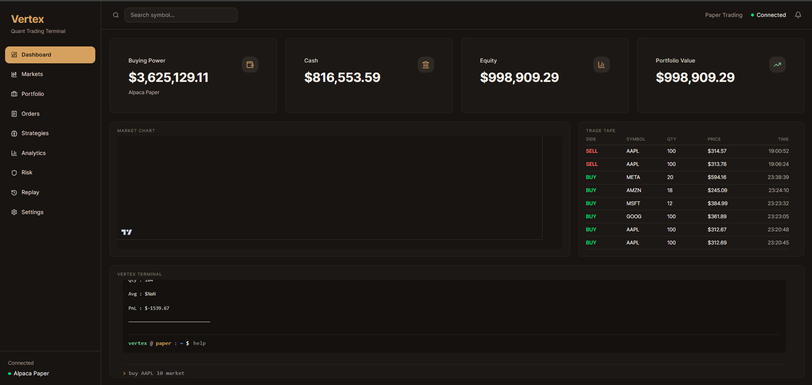
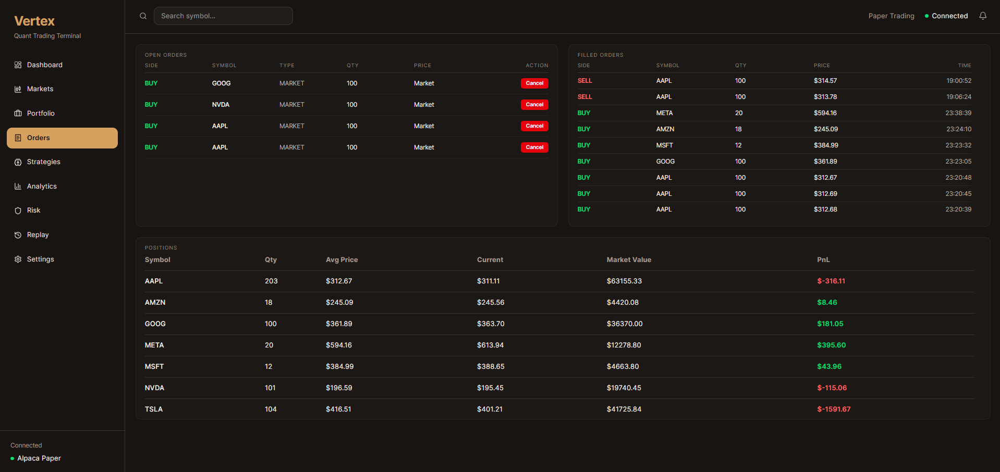
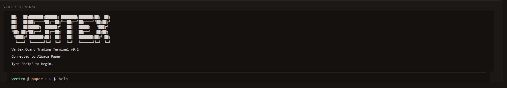

<div align="center">

# Vertex

### Modern Quantitative Trading Platform

*A high-performance quantitative trading platform built with C++, Boost.Beast, React and Alpaca Paper Trading.*


</div>

---

# Overview

Vertex is a full-stack quantitative trading platform designed from the ground up for systematic trading research and execution.

The project combines a modern React trading terminal with a high-performance C++ backend, exposing a REST API that communicates with Alpaca Paper Trading.

Current capabilities include live paper trading, portfolio management, order execution, market visualization, and an interactive trading terminal.

Future releases will expand Vertex into a complete quantitative research environment with strategy execution, backtesting, portfolio analytics, AI-assisted workflows, and market replay.

---

# Screenshots

## Dashboard



---

## Orders



---

## Trading Terminal



---

# Features

## Trading

- Live Paper Trading via Alpaca
- Market Orders
- Limit Orders
- Order Cancellation
- Buying Power Tracking
- Cash Tracking
- Portfolio Value
- Equity Tracking

---

## Market Data

- Live Candlestick Charts
- Trade Tape
- Positions
- Open Orders
- Filled Orders

---

## Interactive Terminal

Supports commands such as

```
help

account

positions

orders

buy AAPL 10 market

sell NVDA 5 market

clear
```

---

## Dashboard

- Professional Trading UI
- Dark Theme
- Responsive Layout
- Real-Time Portfolio Metrics
- Lightweight Charts Integration

---

# Architecture

```
                    React + TypeScript
                            │
                            ▼
                    REST API Client
                            │
                            ▼
                    Boost.Beast Server
                            │
             ┌──────────────┴──────────────┐
             ▼                             ▼
      Trading Engine               Alpaca Client
             │                             │
             └──────────────┬──────────────┘
                            ▼
                   Alpaca Paper Trading
```

---

# Tech Stack

## Backend

- C++20
- Boost.Beast
- Boost.Asio
- libcurl
- nlohmann/json
- CMake

---

## Frontend

- React
- TypeScript
- TailwindCSS
- TanStack Query
- Axios
- Lightweight Charts
- Lucide Icons

---

## Broker

- Alpaca Paper Trading API

---

# Repository Structure

```
vertex/

├── backend/
│   ├── controllers/
│   ├── router/
│   ├── models/
│   ├── services/
│   └── alpaca/
│
├── frontend/
│   ├── components/
│   ├── hooks/
│   ├── pages/
│   ├── services/
│   └── layouts/
│
├── docs/
│
├── README.md
│
└── CMakeLists.txt
```

---

# Current Functionality

- Live account information
- Order execution
- Position management
- Trade history
- Open orders
- Interactive trading terminal
- Candlestick chart visualization
- REST API communication
- Modern trading dashboard

---

# Roadmap

## v0.1 ✅

- Trading Dashboard
- Trading Terminal
- Alpaca Integration
- Live Orders
- Positions
- Portfolio Metrics

---

## v0.2

- Strategy Runtime
- Moving Average Strategy
- Mean Reversion Strategy
- Strategy Management
- Strategy Dashboard

---

## v0.3

- Historical Backtesting
- Performance Reports
- Portfolio Analytics
- Risk Metrics
- Equity Curve

---

## v0.4

- AI Trading Assistant
- Natural Language Terminal
- Strategy Generation
- Trade Explanations
- AI Research Tools

---

## v1.0

- Market Replay
- Portfolio Optimization
- Walk Forward Analysis
- Multi Broker Support
- Plugin SDK
- Distributed Backtesting

---

# Installation

## Clone

```bash
git clone https://github.com/<your-username>/vertex.git

cd vertex
```

---

## Backend

```bash
mkdir build

cd build

cmake ..

cmake --build .
```

---

## Frontend

```bash
cd frontend

npm install

npm run dev
```

---

# Why Vertex?

Most retail trading platforms are designed for discretionary trading.

Vertex is being built as a foundation for **systematic trading**, where strategies, execution, analytics, and research coexist inside a single platform.

The long-term goal is to evolve Vertex from a trading dashboard into a complete quantitative research environment.

---

# Contributing

Contributions, suggestions, and discussions are always welcome.

If you'd like to improve Vertex, feel free to open an issue or submit a pull request.

---

# License

This project is released under the MIT License.

---

<div align="center">

### Vertex

*A Quantitative Trading Platform built with modern systems programming and web technologies.*

⭐ If you find the project interesting, consider giving it a star.

</div>
